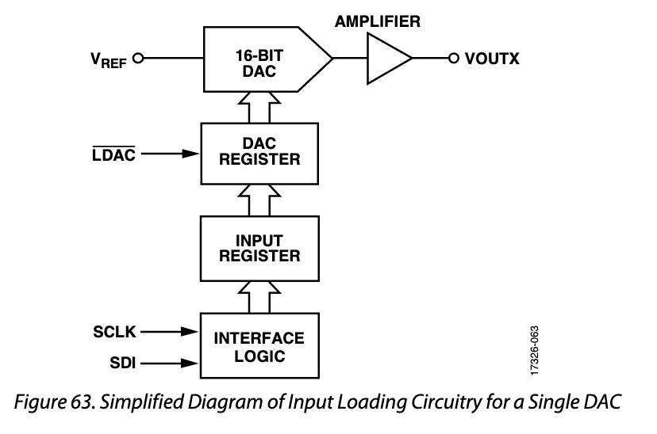
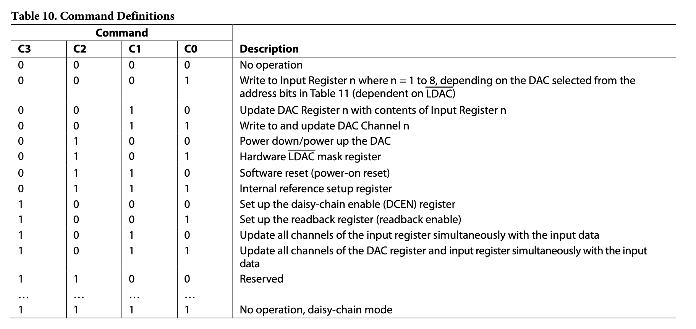
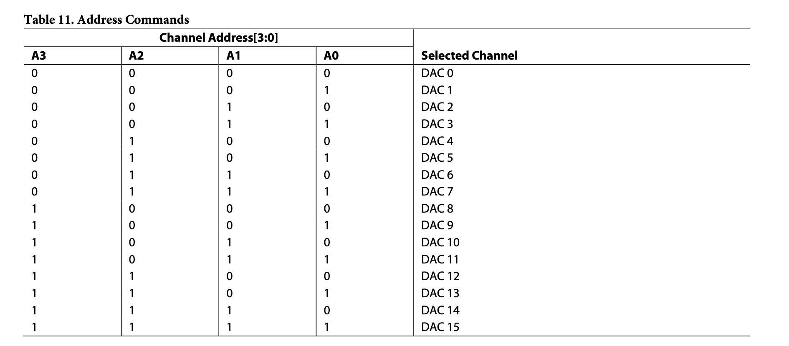

# Notes for programming the AD5679R
Firstly the AD5679R is a 16-bit, 16 channel DAC.
All info noted here is take from the datasheet.
Communication is done via a 4-wire SPI interface, with an additional
LDAC signal for loading data from the input registers to the DACs.
The interface is summarized here, not shown is the CS/SYNC or SDO pins.

.

The SPI operates via individual 24-bit words, MSB first.
The first 4-bits are command bits, C3-C0, to indicate what operation should take
place. The next 4-bits are address bits, A3-A0, to specify which of the 16 channels
should recieve the command/data.
And the final 16-bits are the data bits, DB15-DB0.
Data is clocked in on the *falling* edge of SCLK, and a valid data transfer must
begin with the SYNC pin being pulled low and end with the SYNC pin going high
after 24 falling edges on SCLK.

The below table summarizes the commands available.
Almost no commands here are self explanatory, so more detail will be provided.

Here's the table for addresses...it is straight forward, probably doesn't need
much explanation

## Command discussion
### Command `0b0000`, No operation
Self explanatory I hope

### Command `0b0001`, Write to Input Register 'n'
'n' is the DAC specified by the address bits.
This is the command for writing the DAC value, i.e. the desired output voltage.
More specifically, this is the command for writing to the input register.
That input register value gets shipped to the channel when the LDAC pin is toggled,
or (maybe) when some other regiser are written to.

### Command `0b0010`, Update DAC Register 'n' with Input Register 'n'
For this one the data bits DB15 - DB0 act as a mask for deciding which
channels get updated from their respective input register and which don't.
Which means that the address bits aren't used...I think?

### Command `0b0011`, Write to and update DAC channel 'n'
Kinda self-explanatory, you write you DAC value directly to channel 'n',
no need to fiddle with the LDAC pin or anything like that.
'n' is specified by the address bits.
One open question I have with this is if the input register is updated by this,
or if the input register bypassed and the DAC's register is written to directly.
I can (and should) test this at some point.

### Command `0b0100`, Power down
I don't suspect we'll ever need this, cause I don't see any reason we'd need to
power down a channel...power consumption is not a big concern for us.
Nonetheless, I'll try provide some info.

For this command the address bits are almost not used -- the top address bit,
A3, specifies if the command should got to the first 8 channels or the latter
8 channels (A3=0 is bottom half).
A2-A0 do not matter.
Then each pair of data bits specify if the corresponding channel should be powered
up or not, so DB0 & DB1 are for DAC 0 (if A3=0) and DB2 & DB3 are for DAC 1
so on and so forth.
I'm not sure why two bits are used, there are only two states, `0b00` is normal
operation and `0b01` is power-down.

### Command `0b0101`, Hardware LDAC mask register
This is another command where the address bits are not used.
The data bits specify a mask, each bit corresponds to a DAC channel, for
whether or not that channel should pay attention to the LDAC pin;
if a bit is 1, the LDAC pin is ignored.

### Command `0b0110`, Software reset (power-on reset)
In principle pretty simple, writing to this causes the DAC to do a power-on reset.
For this the address bits must be 0x0 and the data bits must be 0x1234.
For our model of DAC  (the AD5678R-1) the power-on reset value for each DAC
is 0.

### Command `0b0111`, Internal reference setup
Again the address bits don't matter, in fact the only bits that do matter
are the command bits (obviously) and DB1 & DB0. DB1 must be 0, DB0=0 means the
reference is enabile (default). DB0=1 means its disabled.
It's not totally clear to me what happens when the reference is disabled...I think
the only reason to disable it though is to save power.
And you'd only turn the reference off once all the channels have also been
powered down
So shouldn't ever be necessary really.

### Command `0b1000`, Set up daisy-chain enable (DCEN)
This is for daisy chaining multiple AD5679s together using the SDO pin as the 
SDI input for the next device.
Not useful for us and the default is to disable this (standalone mode).

### Command `0b1001`, read-back enable
This seems kinda useful.
For a read-back operation the SDO pin is enabled for the duration of the readback,
then disabled again (unless daisy-chain is mode enabled).
The address bits are used to select which DAC input register should be read,
and the write data bits are "do not care".
Then, during the next SPI write, the read-back data will appear on the SDO.
So that means it might be a good idea to just do every read-back command twice,
one after another. Or maybe follow every read-back with a NO-OP command.

It's not clear to me if this reads back the input register for a channel, or
if it reads back the DAC register value.
The data sheet seems to say both things...so I think this would have to be tested.

### Command `0b1010`, Update all channels of the input register simultaneous with the input data
Hopefully self explanatory, cause the data sheet provides no info on this
register as far as I can tell

### Command `0b1011`, Update all channels of the DAC register and input register simultaneously with the input data
Hopefully self explanatory, cause the data sheet provides no info on this
register as far as I can tell

### Command `0b1111`, No operation, daisy-chain mode
It's not really clear to me what this does, but I don't plan on ever using the
daisy chain functionality...so just don't touch this one.

